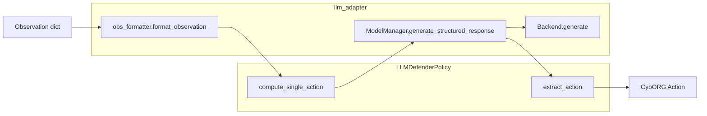
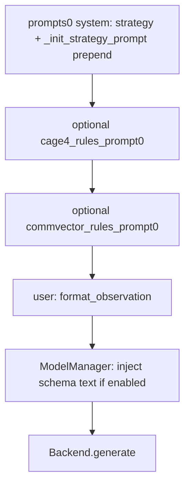

# LLM Defender Agent: Construction, Configuration, and Execution

This guide explains in detail how the **LLM-based blue defender** is built in code: **object construction order**, **where prompt engineering lives**, **which configuration values are injected and where**, and **which functions run at inference time**. It also states clearly what this project does **not** do (LLM weight training).

**Related:** Cybermonic RL training (PPO/GNN) is documented in [`docs/CYBERMONIC_RL_AGENT_GUIDE.md`](CYBERMONIC_RL_AGENT_GUIDE.md).

**Document conventions:** Paths are relative to the repository root unless noted. Files under `cage-challenge-4/CybORG/` mirror or extend the top-level `CybORG/` tree; evaluation scripts often run with working directory `cage-challenge-4/`.

---

## Inference-time control vs weight fine-tuning

**This repository does not fine-tune, LoRA-tune, or otherwise update LLM weights.** There is no supervised fine-tuning loop, no RLHF on the language model, and no gradient step applied to model parameters inside this codebase.

- **`cybermonic_train.py`** trains **Cybermonic RL** policies (graph + PPO), not the LLM.
- What *does* shape behavior for the LLM defender is entirely **inference-time**:
  - **Prompts** (YAML strategy text + Python prepends + optional extra system prompts).
  - **Decoding and API settings** in model YAML (`generate:` temperature, max tokens, etc.) and backend constructors.
  - **Post-processing** in `ModelManager` (JSON schema pressure, repair turns, IOC semantic checks) and in `LLMDefenderPolicy.extract_action` (mapping text to CybORG actions).

If you are looking for “functions that fine-tune the LLM,” the accurate answer is: **there are none here**—only functions that **configure, prompt, call, parse, validate, and map** model outputs.

---

## Executive summary

End-to-end data flow for one environment step:

1. **`DefenderAgent.get_action`** calls the policy’s **`compute_single_action`** with the raw observation.
2. **`LLMDefenderPolicy`** builds a chat transcript: strategy system prompt(s) + **user** message = **`obs_formatter.format_observation(...)`**.
3. **`ModelManager.generate_structured_response`** may augment the system message, calls the **backend** `generate(messages)`, parses JSON, runs **repair** and **IOC validation** as configured, returns `{"action": "...", "reason": "..."}`.
4. **`extract_action`** turns that string into a concrete CybORG action (`Remove`, `Sleep`, etc.).



---

## Related papers: algorithms and code mapping

The methodology paper and the contribution analysis in [`docs/Related_Papers_Contribution_Analysis.md`](Related_Papers_Contribution_Analysis.md) tie **related work** (Singh et al., King et al., Hammar et al., Gao et al.) to concrete mechanisms. The table below lists what is **actually implemented** in this repository’s LLM path—**file and function names**—versus what remains **roadmap / evaluation-only** (see the “Consolidated Implementation Roadmap” in that doc).

### Implemented in the LLM stack

| Idea (source) | What it does | Where it lives |
|---------------|--------------|----------------|
| **IOC-aware prompt text** (Singh et al.—IOC-enhanced observation) | Per-host signals, IOC priority labels, evidence lines, comm vectors | [`obs_formatter.py`](../CybORG/Agents/LLMAgents/llm_adapter/obs_formatter.py): `_collect_host_signals`, `_ioc_label`, `_format_ioc_summary_section`, **`format_observation`** |
| **Topology-aware prompt text** (King et al.—graph context for LLM) | Zones and host lists; path hint for operational vs mission proximity | Same file: **`_format_topology_section`**, `_infer_zone`, **`Proximity`** in IOC lines via `_collect_host_signals` |
| **Chain-of-Self-Correction (CoSC)** | Repair turns after bad JSON or failed semantic check; optional IOC feedback in repair prompt | [`model_manager.py`](../CybORG/Agents/LLMAgents/llm_adapter/model_manager.py): **`generate_structured_response`** (repair loop), YAML flags **`self_correction`**, **`repair_attempts`** |
| **IOC expert-style gating** (Singh et al.—rule layer for CoSC) | Block inappropriate Remove/Restore from IOC text; require recovery when severity warrants | `model_manager.py`: **`_validate_action_against_ioc`**, **`_extract_ioc_priorities_from_messages`**, YAML **`preventative_cosc`** |
| **Schema-constrained JSON** | Force `action` / `reason` JSON shape on the system message | `model_manager.py`: **`STRUCTURED_OUTPUT_INSTRUCTION`**, **`_inject_structure_instruction`**, YAML **`schema_constraints`** |
| **Hallucination taxonomy (syntax vs semantics)** | Count parse failures vs IOC-gated rejections vs repairs vs Sleep fallback | `model_manager.py`: **`hallucination_metrics`**, **`get_hallucination_metrics`** |
| **Trace / false-positive hint** | JSONL fields for analysis (e.g. Remove/Restore vs max IOC priority) | [`llm_policy.py`](../CybORG/Agents/LLMAgents/llm_policy.py): **`_append_step_trace`**, **`_extract_max_ioc_priority`** |
| **Evaluation hallucination rate** (aggregate) | Reads run summaries for comparison matrices | [`run_model_comparison.py`](../CybORG/Evaluation/llamagym/run_model_comparison.py) (hallucination fields from result JSON) |

**Perceive → Reason → Plan → Act** (Gao et al.—narrative pipeline): at the code level this aligns loosely with **`format_observation`** (perceive) → model + prompts (reason/plan) → **`generate_structured_response`** + **`extract_action`** (act). There is **no** separate Monte-Carlo lookahead or in-loop tactic recalibration module in this repo.

### Not implemented in the LLM path (see analysis doc)

These are discussed in [`Related_Papers_Contribution_Analysis.md`](Related_Papers_Contribution_Analysis.md) as **future or paper-level** items: multi-call **lookahead consistency** and **conformal abstention** with a calibrated threshold (Hammar et al.), full **Monte-Carlo lookahead** and **tactic recalibration** (Gao et al.), **LoRA / SFT** on CAGE-4 trajectories (Gao et al.), Singh-style **Recovery Precision / Clean Hosts** as first-class logged metrics unless added elsewhere in evaluation, and **CMDP-style seed sweeps** (King et al.) as a reporting protocol rather than a single function.

---

## How the LLM defender is constructed (runtime order)

### 1) Submission wiring

Evaluation code registers blue agents. For Cybermonics-style runs, see [`cage-challenge-4/CybORG/Evaluation/Cybermonics/submission.py`](../cage-challenge-4/CybORG/Evaluation/Cybermonics/submission.py): it builds `AGENTS` with **`DefenderAgent(blue_agent_N, LLMDefenderPolicy, [])`** for the slot chosen by `BLUE_AGENT_NAME` (from [`config_vars.py`](../CybORG/Agents/LLMAgents/config/config_vars.py)), or all five LLM agents if `ALL_LLM_AGENTS` is true.

An alternate path is [`CybORG/Evaluation/llamagym/submission.py`](../CybORG/Evaluation/llamagym/submission.py).

### 2) `DefenderAgent`

[`CybORG/Agents/LLMAgents/llm_agent.py`](../CybORG/Agents/LLMAgents/llm_agent.py) wraps a Ray **`Policy`**. On init it does:

`self.policy = policy(obs_space, None, {"agent_name": name})`

So **`LLMDefenderPolicy`** is constructed with **`agent_name`** set to e.g. `blue_agent_4`.

### 3) `LLMDefenderPolicy.__init__`

In [`llm_policy.py`](../CybORG/Agents/LLMAgents/llm_policy.py) (module scope):

- **`model_config`** = `os.environ.get("CAGE4_MODEL_CONFIG", default_config_path)` where `default_config_path` joins the package directory with **`CONFIG_MODEL_PATH`** from `config_vars.py`.
- **`strategy_prompt_path`** = `os.environ.get("CAGE4_PROMPTS_CONFIG", default_prompts_path)` with default **`STRATEGY_PROMPT_PATH`**.

Then in **`__init__`**:

- **`self.subnet`** from `CAGE4_SUBNETS` using the agent index (`int(self.name[-1])`).
- **`self.model_manager = ModelManager(ConfigLoader.load_model_configuration(model_config))`** — the YAML file is read once at policy construction.
- **`_load_all_prompts()`** loads the strategy YAML via **`ConfigLoader.load_prompts`**, then **`_init_strategy_prompt`** prepends runtime text to the first system message.

No LLM weights are loaded in-process for API backends; the backend holds **endpoint + hyperparameters** and issues HTTP/API calls.

### 4) `ModelManager` and backend

[`ConfigLoader.load_model_configuration`](../CybORG/Agents/LLMAgents/llm_adapter/config_loader.py) returns a **dict** (YAML).  
[`ModelManager.__init__`](../CybORG/Agents/LLMAgents/llm_adapter/model_manager.py) stores it and calls **`BackendFactory.create_backend(backend_name, hyperparams)`**. Each backend (e.g. [`OllamaBackend`](../CybORG/Agents/LLMAgents/llm_adapter/backend/ollama.py)) reads the fields it needs (`model_name`, `generate.*`, `base_url`, etc.).

---

## Per-step message assembly (exact order)

Before any API call, `compute_single_action` builds **`current_episode_messages`**:

1. **`self.prompts[0]`** — strategy system message (already modified by **`_init_strategy_prompt`**).
2. If **`INCLUDE_PROMPT_CAGE4_RULES`**: **`self.cage4_rules_prompt[0]`** (extra system message).
3. If **`INCLUDE_PROMPT_COMMVECTOR_RULES`**: **`self.commvector_rules_prompt[0]`** (extra system message).
4. **`{"role": "user", "content": obs_message}`** where **`obs_message = obs_formatter.format_observation(obs, self.last_action, self.name)`**.

**After** this list is built, **`ModelManager.generate_structured_response`** runs. If **`schema_constraints`** is enabled (default **true** in YAML unless set false), **`_inject_structure_instruction`** appends the structured JSON instruction to the **first** system message (or inserts a new system message).

Optional **multi-turn** behavior: if `len(self.prompts) > 1` and the optional rules flags are false, the policy loops over additional strategy prompts, each time calling **`generate_structured_response`** again with an growing transcript (see `llm_policy.py`).



---

## Where prompt engineering lives

| Layer | Location | What it contributes |
|-------|----------|---------------------|
| Strategy / task prompt | [`CybORG/Agents/LLMAgents/config/prompts/acd2025/base.yml`](../CybORG/Agents/LLMAgents/config/prompts/acd2025/base.yml) (override path with **`CAGE4_PROMPTS_CONFIG`**) | Long system content: mission, `# DESCRIPTION`, `## AVAILABLE ACTIONS`, `## EXAMPLE RESPONSES`, environment narrative. |
| Runtime prepend | **`_init_strategy_prompt`** in [`llm_policy.py`](../CybORG/Agents/LLMAgents/llm_policy.py) | Prepends `AGENT_NAME`, pointers to optional rules sections, “Return ONLY ONE action…”, `# INSTRUCTIONS` before the YAML body. |
| Optional environment rules | Flags + paths in [`config_vars.py`](../CybORG/Agents/LLMAgents/config/config_vars.py): `INCLUDE_PROMPT_CAGE4_RULES`, `CAGE4_RULES_PROMPT_PATH`, `INCLUDE_PROMPT_COMMVECTOR_RULES`, `COMMVECTOR_RULES_PROMPT_PATH` | Extra **system** messages loaded from YAML when toggles are true. |
| Structured JSON steering | **`ModelManager.STRUCTURED_OUTPUT_INSTRUCTION`** and **`_inject_structure_instruction`** in [`model_manager.py`](../CybORG/Agents/LLMAgents/llm_adapter/model_manager.py) | Forces “valid JSON with keys `action` and `reason`” wording on the system message when **`schema_constraints`** is true. |
| Repair turns | **`generate_structured_response`** repair user messages in `model_manager.py` | After a bad or semantically rejected parse, appends assistant raw output + user text asking for strict JSON with **semantic feedback** (up to **`repair_attempts`**). |
| Observation as “prompt” | **`format_observation`** in [`obs_formatter.py`](../CybORG/Agents/LLMAgents/llm_adapter/obs_formatter.py) | Turns the CybORG observation dict into the **user** message string (IOC summary, host signals, comm vectors, etc.). This is part of what the model conditions on every step. |

---

## Configuration parameters: sources and injection

### `config_vars.py` ([`CybORG/Agents/LLMAgents/config/config_vars.py`](../CybORG/Agents/LLMAgents/config/config_vars.py))

| Symbol / setting | Role |
|------------------|------|
| `BLUE_AGENT_NAME` | Which blue slot uses the LLM in submissions (e.g. `blue_agent_4`). |
| `ALL_LLM_AGENTS`, `NO_LLM_AGENTS` | Team layout flags; must not contradict each other. |
| `CONFIG_MODEL_PATH` | Default **relative** path to model YAML (under `LLMAgents/`). |
| `STRATEGY_PROMPT_PATH` | Default relative path to strategy prompt YAML. |
| `ENV_VAR_MODEL` = `CAGE4_MODEL_CONFIG` | If set, **full path or path** to model YAML; overrides `CONFIG_MODEL_PATH` join. |
| `ENV_VAR_PROMPT` = `CAGE4_PROMPTS_CONFIG` | Overrides strategy prompt file path. |
| `INCLUDE_PROMPT_CAGE4_RULES`, `INCLUDE_PROMPT_COMMVECTOR_RULES` | Load extra rule prompts. |
| `CAGE4_RULES_PROMPT_PATH`, `COMMVECTOR_RULES_PROMPT_PATH` | Paths to those rule YAMLs. |
| `DEBUG_MODE` | Verbose logging via `Logger`. |
| `TOTAL_STEPS_PROGRESS_BAR` | Progress bar total; can follow `CAGE4_PROGRESS_BAR_TOTAL`, `CAGE4_BASELINE_MAX_EPS`, `CAGE4_BASELINE_EPISODE_LENGTH`. |

### Model YAML (`config/model/*.yml`)

Read once at **`ModelManager`** construction. Typical keys:

| Key | Consumed by | Purpose |
|-----|-------------|---------|
| `backend` | `BackendFactory` | Selects implementation: `ollama`, `openai`, `new-openai`, `huggingface`, `deepseek`, `dummy`. |
| `model_name` | Backends | Provider model id (e.g. `qwen2.5:7b`). |
| `base_url` | e.g. `OllamaBackend` | OpenAI-compatible API base; see **env override** below. |
| `generate.temperature`, `generate.max_new_tokens`, `generate.max_length`, `generate.top_p` | Backends | Decoding / length limits passed into API calls. |
| `schema_constraints` | `ModelManager` | Default **true** if omitted; enables `_inject_structure_instruction`. |
| `self_correction` | `ModelManager` | Enables repair loop (default **true** if omitted). |
| `repair_attempts` | `ModelManager` | Max repair rounds (default **1** if omitted). |
| `preventative_cosc` | `ModelManager` | IOC semantic gating (default **true** if omitted). |
| `ollama_options`, `keep_alive`, `request_timeout_sec`, `max_retries` | `OllamaBackend` / requests | Server options and robustness. |

**Environment variables for secrets and endpoints** (not in YAML):

| Variable | Used when |
|----------|-----------|
| `OPENAI_API_KEY` | `openai` / `new-openai` backends |
| `OPENROUTER_API_KEY` | `deepseek` backend |
| `HF_TOKEN` | `huggingface` backend |
| **`OLLAMA_BASE_URL`** | Overrides YAML `base_url` in [`OllamaBackend`](../CybORG/Agents/LLMAgents/llm_adapter/backend/ollama.py) if set |

### Policy runtime environment (read in `llm_policy.py`)

| Variable | Effect |
|----------|--------|
| `CAGE4_STEP_TRACE_PATH` | If set, append JSONL step traces via **`_append_step_trace`**. |
| `CAGE_EPISODE_LENGTH`, `CAGE4_MAX_EPS` | Progress bar total and trace episode estimate. |

---

## Function reference (inference and validation only)

These **do not** update LLM weights; they **configure, call, parse, validate, and map**.

### `LLMDefenderPolicy` ([`llm_policy.py`](../CybORG/Agents/LLMAgents/llm_policy.py))

| Function | Responsibility |
|----------|----------------|
| `__init__` | Load model YAML into `ModelManager`; load prompts; init progress bar. |
| `_load_all_prompts` | Load strategy YAML; optionally load CAGE4 / commvector rule YAMLs. |
| `_init_strategy_prompt` | Prepend agent-specific instructions to first system message. |
| `compute_single_action` | Build message list, call `generate_structured_response`, then `extract_action`. |
| `extract_action` | Parse `action` string → `Remove`, `Restore`, `BlockTrafficZone`, `AllowTrafficZone`, `DeployDecoy`, `Analyse`, or `Sleep`. |
| `generate_response` | Thin wrapper to `model_manager.generate_response` (raw string). |
| `_append_step_trace` | Optional JSONL logging for analysis. |

### `ModelManager` ([`model_manager.py`](../CybORG/Agents/LLMAgents/llm_adapter/model_manager.py))

| Function | Responsibility |
|----------|----------------|
| `generate_structured_response` | Orchestrate parse, IOC check, repair loop, fallback to Sleep dict. |
| `generate_response` | Call `model_backend.generate`; on exception return default Sleep JSON string. |
| `_inject_structure_instruction` | Merge `STRUCTURED_OUTPUT_INSTRUCTION` into system content when enabled. |
| `_parse_structured_payload` | JSON / heuristic extraction of `action` and `reason`. |
| `_validate_action_against_ioc` | Preventative semantic checks using IOC priorities from the user message. |
| `_extract_ioc_priorities_from_messages` | Parse IOC lines from formatted observation text. |
| `_normalize_action` | Canonicalize action synonyms (used in parsing). |

### Backends ([`llm_adapter/backend/`](../CybORG/Agents/LLMAgents/llm_adapter/backend/))

| Method | Responsibility |
|--------|----------------|
| `generate(messages)` | Send chat messages to the provider; return assistant **text** (string). |

Example: **`OllamaBackend.generate`** calls OpenAI-compatible `chat.completions.create` with `temperature`, `max_tokens`, and `extra_body` for Ollama options.

### Observation formatting ([`obs_formatter.py`](../CybORG/Agents/LLMAgents/llm_adapter/obs_formatter.py))

| Function | Responsibility |
|----------|----------------|
| `format_observation(observation, last_action, agent_name)` | Build the **user** message string seen by the model (network/host narrative, IOC summary, comm vectors, etc.). |

---

## Algorithms at inference time (summary)

1. **Structured output** — System text + optional schema instruction steers JSON; parser tolerates imperfect text.
2. **Self-correction / repair** — Failed parse or failed IOC validation triggers additional user/assistant turns with feedback, up to **`repair_attempts`**.
3. **Preventative IOC gating** — **`_validate_action_against_ioc`** rejects inappropriate Remove/Restore when IOC evidence does not justify them (when **`preventative_cosc`** is true).
4. **Action extraction** — **`extract_action`** maps the final `action` string to a CybORG `Action` object.
5. **Telemetry** — Optional **`wandb`** action counts; optional **`CAGE4_STEP_TRACE_PATH`** JSONL.

---

## Copy-paste: tunable inference settings

**“Tune” here means inference-time hyperparameters and prompts** (decoding, CoSC flags, endpoints)—not LoRA or weight fine-tuning. Save edits under `CybORG/Agents/LLMAgents/` (or the same paths under `cage-challenge-4/` when you run from that tree).

### Model YAML keys (what each knob does)

| Key | Typical values | Effect |
|-----|----------------|--------|
| `backend` | `ollama`, `openai`, `new-openai`, `huggingface`, `deepseek`, `dummy` | Which API client [`BackendFactory`](../CybORG/Agents/LLMAgents/llm_adapter/model_manager.py) constructs. |
| `model_name` | e.g. `qwen2.5:7b`, `gpt-4o` | Provider model id. |
| `base_url` | `http://127.0.0.1:11434/v1` | OpenAI-compatible URL (Ollama). Overridden by env **`OLLAMA_BASE_URL`** if set. |
| `generate.temperature` | `0.0`–`1.0+` | Sampling randomness (Ollama/OpenAI backends pass through to the API). |
| `generate.max_new_tokens` | e.g. `512`, `768` | Cap on generated tokens per call. |
| `generate.max_length` | e.g. `1024` | Context/window hint (usage depends on backend). |
| `generate.top_p` | e.g. `0.95` | Nucleus sampling (when supported). |
| `schema_constraints` | `true` / `false` | If `true`, append strict JSON instruction via `_inject_structure_instruction` (default in code: **true** if omitted). |
| `self_correction` | `true` / `false` | Enable repair loop after bad parse or IOC rejection (default **true** if omitted). |
| `repair_attempts` | `0`, `1`, `3`, … | Max repair rounds (default **1** if omitted). |
| `preventative_cosc` | `true` / `false` | IOC semantic gating before accepting an action (default **true** if omitted). |
| `request_timeout_sec` | e.g. `120` | HTTP timeout for the client. |
| `max_retries` | e.g. `0` | Library-level retries on failed requests. |
| `keep_alive` | e.g. `"0m"` | Ollama unload behavior (`extra_body`). |
| `ollama_options.num_ctx` | e.g. `4096` | Ollama context size (`extra_body.options`). |

### Template: `config/model/my_run.yml` (Ollama example)

Copy to a new file, adjust values, then point **`CAGE4_MODEL_CONFIG`** at it (absolute path or path relative to your evaluation cwd).

```yaml
# Inference-only profile — not weight training
backend: "ollama"
model_name: "qwen2.5:7b"
base_url: "http://127.0.0.1:11434/v1"

schema_constraints: true
self_correction: true
repair_attempts: 3
preventative_cosc: true

request_timeout_sec: 120
max_retries: 0
keep_alive: "0m"

ollama_options:
  num_ctx: 4096

generate:
  max_new_tokens: 768
  max_length: 1024
  temperature: 1.0
  top_p: 0.95
```

### Shell / `.env` snippet

Set these in your shell before `python -m CybORG.Evaluation...`, or put `export` lines in a file and `source` it (same variable names work in `.env` if your loader exports them).

```bash
# Required for many runs: which YAML files to load (use absolute paths if unsure)
export CAGE4_MODEL_CONFIG="/path/to/repo/CybORG/Agents/LLMAgents/config/model/my_run.yml"
export CAGE4_PROMPTS_CONFIG="/path/to/repo/CybORG/Agents/LLMAgents/config/prompts/acd2025/base.yml"

# Ollama: overrides base_url inside the model YAML
export OLLAMA_BASE_URL="http://127.0.0.1:11434/v1"

# Provider secrets (set only what your backend uses)
export OPENAI_API_KEY="sk-..."
export OPENROUTER_API_KEY="..."
export HF_TOKEN="..."

# Optional: JSONL trace log for offline analysis
export CAGE4_STEP_TRACE_PATH="/path/to/run_steps.jsonl"

# Optional: episode shape for progress bar / trace metadata
export CAGE_EPISODE_LENGTH="500"
export CAGE4_MAX_EPS="2"
```

### Minimal `config_vars.py` defaults (edit or override with env)

Values here are read when the `LLMAgents` package loads; **`CAGE4_MODEL_CONFIG` / `CAGE4_PROMPTS_CONFIG` override** the default paths at runtime.

```python
# CybORG/Agents/LLMAgents/config/config_vars.py (excerpt)
BLUE_AGENT_NAME = "blue_agent_4"
CONFIG_MODEL_PATH = "config/model/deepseek-r1-1.5b.yml"
STRATEGY_PROMPT_PATH = "config/prompts/acd2025/base.yml"
INCLUDE_PROMPT_CAGE4_RULES = False
INCLUDE_PROMPT_COMMVECTOR_RULES = False
DEBUG_MODE = True
```

### What to turn if…

| Goal | Knob |
|------|------|
| More randomness | Raise `generate.temperature` and/or `top_p` |
| Longer model replies | Raise `generate.max_new_tokens`; for Ollama raise `ollama_options.num_ctx` if you hit context limits |
| Stricter JSON shape | Keep `schema_constraints: true` |
| More self-correction turns | Raise `repair_attempts`; keep `self_correction: true` |
| Disable repair loop entirely | `self_correction: false` or `repair_attempts: 0` |
| Looser IOC gating | `preventative_cosc: false` (disables `_validate_action_against_ioc` behavior) |
| Different system / strategy text | Change `STRATEGY_PROMPT_PATH` or set **`CAGE4_PROMPTS_CONFIG`** to another YAML |
| Different blue slot for the LLM | Change **`BLUE_AGENT_NAME`** (must match submission expectations) |
| Point Ollama at another host | **`OLLAMA_BASE_URL`** or `base_url` in model YAML |

---

## How to run the LLM defender

### Prerequisites

```bash
source env-cage/bin/activate
```

Ensure `cage-challenge-4` exists (use `shell_scripts/install_unified.sh` if needed). For Ollama, set YAML `base_url` or export **`OLLAMA_BASE_URL`**. Source **`.env`** for API keys as needed.

### Strict Cybermonics script (from repo root)

```bash
bash shell_scripts/run_cybermonics_strict.sh deepseek
# or
bash shell_scripts/run_cybermonics_strict.sh qwen
```

The script **`cd`s into `cage-challenge-4`**, sets baseline env vars, and sets **`CAGE4_MODEL_CONFIG`** to a path **relative to that directory**, e.g. `CybORG/Agents/LLMAgents/config/model/ollama-deepseek-r1-8b.yml` or `qwen2.5-7b.yml`. Results are written under `results/cybermonics_strict_comparison_*`.

### Manual overrides

```bash
export CAGE4_MODEL_CONFIG="/absolute/path/to/my-model.yml"
export CAGE4_PROMPTS_CONFIG="/absolute/path/to/my-prompts.yml"
```

If unset, defaults from `config_vars.py` apply, resolved relative to the `LLMAgents` package directory.

### Dummy backend

Use `config/model/dummy.yml` (`backend: "dummy"`) to exercise the pipeline without a live model.

---

## Quick reference checklist

| Goal | What to change |
|------|------------------|
| Which blue agent is the LLM | `BLUE_AGENT_NAME` in `config_vars.py` and matching submission |
| Swap model / decoding | Edit or add `config/model/*.yml`; set **`CAGE4_MODEL_CONFIG`** |
| Swap strategy instructions | Edit `config/prompts/...` or set **`CAGE4_PROMPTS_CONFIG`** |
| Tune robustness | `schema_constraints`, `self_correction`, `repair_attempts`, `preventative_cosc` in model YAML |
| Point Ollama elsewhere | YAML `base_url` or **`OLLAMA_BASE_URL`** |
| Full evaluation | `bash shell_scripts/run_cybermonics_strict.sh ...` or `python -m CybORG.Evaluation.evaluation` from **`cage-challenge-4`** with the submission path your run expects |

---

## Related documentation

- [`docs/CYBERMONIC_RL_AGENT_GUIDE.md`](CYBERMONIC_RL_AGENT_GUIDE.md) — Cybermonic RL training (KEEP / PPO+GNN; not LLM weights).
- [`docs/Related_Papers_Contribution_Analysis.md`](Related_Papers_Contribution_Analysis.md) — Related work, contribution roadmap, and paper-section mapping.
- [`README.md`](../README.md) — Install, `env-cage`, and run scripts.
